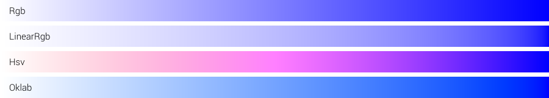
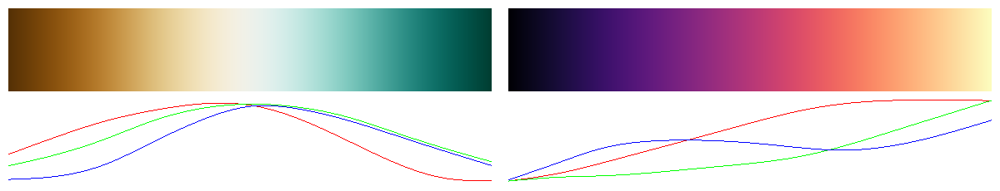

# colorgrad-rs

[](https://github.com/mazznoer/colorgrad-rs)
[](https://github.com/mazznoer/colorgrad-rs)
[](https://crates.io/crates/colorgrad)
[](https://docs.rs/colorgrad)
[](https://github.com/mazznoer/colorgrad-rs/actions)
[](https://codecov.io/gh/mazznoer/colorgrad-rs)
[](https://crates.io/crates/colorgrad)

[Rust](https://www.rust-lang.org/) color scales library for data visualization, charts, games, maps, generative art and others.

## Support This Project

[](https://liberapay.com/mazznoer/donate)

## Index

+ [Custom Gradient](#custom-gradient)
+ [Preset Gradients](#preset-gradients)
+ [Parsing GIMP Gradient](#parsing-gimp-gradient)
+ [Using the Gradient](#using-the-gradient)
+ [Examples](#examples)
+ [Similar Projects](#similar-projects)
+ [Projects using `colorgrad`](#projects-using-colorgrad)

## Usage

Add this to your `Cargo.toml`

```toml
colorgrad = "0.6.1"
```

## Custom Gradient

### Basic

```rust
let g = colorgrad::CustomGradient::new().build()?;
```


### Custom Colors

```rust
use colorgrad::Color;

let g = colorgrad::CustomGradient::new()
    .colors(&[
        Color::from_rgba8(0, 206, 209, 255),
        Color::from_rgba8(255, 105, 180, 255),
        Color::new(0.274, 0.5, 0.7, 1.0),
        Color::from_hsva(50.0, 1.0, 1.0, 1.0),
        Color::from_hsva(348.0, 0.9, 0.8, 1.0),
    ])
    .build()?;
```


### Using Web Color Format

`.html_colors()` method accepts [named colors](https://www.w3.org/TR/css-color-4/#named-colors), hexadecimal (`#rgb`, `#rgba`, `#rrggbb`, `#rrggbbaa`), `rgb()`, `rgba()`, `hsl()`, `hsla()`, `hwb()`, and `hsv()`.

```rust
let g = colorgrad::CustomGradient::new()
    .html_colors(&["#C41189", "#00BFFF", "#FFD700"])
    .build()?;
```


```rust
let g = colorgrad::CustomGradient::new()
    .html_colors(&["gold", "hotpink", "darkturquoise"])
    .build()?;
```


```rust
let g = colorgrad::CustomGradient::new()
    .html_colors(&["rgb(125,110,221)", "rgb(90%,45%,97%)", "hsl(229,79%,85%)"])
    .build()?;
```


### Domain & Color Position

Default domain is [0..1].

```rust
let g = colorgrad::CustomGradient::new()
    .html_colors(&["deeppink", "gold", "seagreen"])
    .build()?;

assert_eq!(g.domain(), (0.0, 1.0));
```


Set the domain to [0..100].

```rust
let g = colorgrad::CustomGradient::new()
    .html_colors(&["deeppink", "gold", "seagreen"])
    .domain(&[0.0, 100.0])
    .build()?;

assert_eq!(g.domain(), (0.0, 100.0));
```


Set the domain to [-1..1].

```rust
let g = colorgrad::CustomGradient::new()
    .html_colors(&["deeppink", "gold", "seagreen"])
    .domain(&[-1.0, 1.0])
    .build()?;

assert_eq!(g.domain(), (-1.0, 1.0));
```


Set exact position for each color. The domain is [0..1].

```rust
let g = colorgrad::CustomGradient::new()
    .html_colors(&["deeppink", "gold", "seagreen"])
    .domain(&[0.0, 0.7, 1.0])
    .build()?;

assert_eq!(g.domain(), (0.0, 1.0));
```


Set exact position for each color. The domain is [15..80].

```rust
let g = colorgrad::CustomGradient::new()
    .html_colors(&["deeppink", "gold", "seagreen"])
    .domain(&[15.0, 30.0, 80.0])
    .build()?;

assert_eq!(g.domain(), (15.0, 80.0));
```


### Blending Mode

```rust
let g = colorgrad::CustomGradient::new()
    .html_colors(&["#FFF", "#00F"])
    .mode(colorgrad::BlendMode::Rgb)
    .build()?;
```



### Interpolation Mode

```rust
let g = colorgrad::CustomGradient::new()
    .html_colors(&["#C41189", "#00BFFF", "#FFD700"])
    .interpolation(colorgrad::Interpolation::Linear)
    .build()?;
```


## Preset Gradients

All preset gradients are in the domain [0..1]. Uniform B-splines is used to interpolate the colors.



### Diverging

`colorgrad::br_bg()`


`colorgrad::pr_gn()`


`colorgrad::pi_yg()`


`colorgrad::pu_or()`


`colorgrad::rd_bu()`


`colorgrad::rd_gy()`


`colorgrad::rd_yl_bu()`


`colorgrad::rd_yl_gn()`


`colorgrad::spectral()`


### Sequential (Single Hue)

`colorgrad::blues()`


`colorgrad::greens()`


`colorgrad::greys()`


`colorgrad::oranges()`


`colorgrad::purples()`


`colorgrad::reds()`


### Sequential (Multi-Hue)

`colorgrad::turbo()`


`colorgrad::viridis()`


`colorgrad::inferno()`


`colorgrad::magma()`


`colorgrad::plasma()`


`colorgrad::cividis()`


`colorgrad::warm()`


`colorgrad::cool()`


`colorgrad::cubehelix_default()`


`colorgrad::bu_gn()`


`colorgrad::bu_pu()`


`colorgrad::gn_bu()`


`colorgrad::or_rd()`


`colorgrad::pu_bu_gn()`


`colorgrad::pu_bu()`


`colorgrad::pu_rd()`


`colorgrad::rd_pu()`


`colorgrad::yl_gn_bu()`


`colorgrad::yl_gn()`


`colorgrad::yl_or_br()`


`colorgrad::yl_or_rd()`


### Cyclical

`colorgrad::rainbow()`


`colorgrad::sinebow()`


## Parsing GIMP Gradient

```rust
use colorgrad::Color;
use std::fs::File;
use std::io::BufReader;

let input = File::open("examples/Abstract_1.ggr")?;
let buf = BufReader::new(input);
let fg = Color::new(0.0, 0.0, 0.0, 1.0);
let bg = Color::new(1.0, 1.0, 1.0, 1.0);
let (grad, name) = colorgrad::parse_ggr(buf, &fg, &bg)?;

assert_eq!(name, "Abstract 1");
```


## Using the Gradient

### Get the domain

```rust
let grad = colorgrad::rainbow();

assert_eq!(grad.domain(), (0.0, 1.0));
```

### Get single color at certain position

```rust
let grad = colorgrad::blues();

assert_eq!(grad.at(0.0).to_rgba8(), [247, 251, 255, 255]);
assert_eq!(grad.at(0.5).to_rgba8(), [109, 174, 213, 255]);
assert_eq!(grad.at(1.0).to_rgba8(), [8,   48,  107, 255]);

assert_eq!(grad.at(0.3).to_rgba8(), grad.repeat_at(0.3).to_rgba8());
assert_eq!(grad.at(0.3).to_rgba8(), grad.reflect_at(0.3).to_rgba8());

assert_eq!(grad.at(0.7).to_rgba8(), grad.repeat_at(0.7).to_rgba8());
assert_eq!(grad.at(0.7).to_rgba8(), grad.reflect_at(0.7).to_rgba8());
```

The difference of `at()`, `repeat_at()` and `reflect_at()`.


### Get n colors evenly spaced across gradient

```rust
let grad = colorgrad::rainbow();

for c in grad.colors(10) {
    println!("{}", c.to_hex_string());
}
```

Output:

```console
#6e40aa
#c83dac
#ff5375
#ff8c38
#c9d33a
#7cf659
#5dea8d
#48b8d0
#4775de
#6e40aa
```

### Hard-Edged Gradient

Convert gradient to hard-edged gradient with 11 segments and 0 smoothness.

```rust
let g = colorgrad::rainbow().sharp(11, 0.0);
```


This is the effect of different smoothness.


## Examples

### Gradient Image

```rust
fn main() -> Result<(), Box<dyn std::error::Error>> {
    let grad = colorgrad::CustomGradient::new()
        .html_colors(&["deeppink", "gold", "seagreen"])
        .build()?;

    let width = 1500;
    let height = 70;

    let mut imgbuf = image::ImageBuffer::new(width, height);

    for (x, _, pixel) in imgbuf.enumerate_pixels_mut() {
        let rgba = grad.at(x as f64 / width as f64).to_rgba8();
        *pixel = image::Rgba(rgba);
    }

    imgbuf.save("gradient.png")?;
    Ok(())
}
```

Example output:


### Colored Noise

```rust
use noise::NoiseFn;

fn main() {
    let scale = 0.015;

    let grad = colorgrad::rainbow().sharp(5, 0.15);
    let ns = noise::OpenSimplex::new();
    let mut imgbuf = image::ImageBuffer::new(600, 350);

    for (x, y, pixel) in imgbuf.enumerate_pixels_mut() {
        let t = ns.get([x as f64 * scale, y as f64 * scale]);
        let rgba = grad.at(remap(t, -0.5, 0.5, 0.0, 1.0)).to_rgba8();
        *pixel = image::Rgba(rgba);
    }

    imgbuf.save("noise.png").unwrap();
}

// Map t which is in range [a, b] to range [c, d]
fn remap(t: f64, a: f64, b: f64, c: f64, d: f64) -> f64 {
    (t - a) * ((d - c) / (b - a)) + c
}
```

Example output:


## Default Feature

* __named-colors__: Enables parsing from [named colors](https://www.w3.org/TR/css-color-4/#named-colors). Requires [`phf`](https://crates.io/crates/phf). Can be disabled using `default-features = false`.

## Similar Projects

* [colorgrad](https://github.com/mazznoer/colorgrad) (Go version of this library)
* [colorous](https://github.com/dtolnay/colorous) (Rust)
* [chroma.js](https://gka.github.io/chroma.js/#color-scales) (Javascript)
* [d3-scale-chromatic](https://github.com/d3/d3-scale-chromatic/) (Javascript)

## Projects using `colorgrad`

* [binocle](https://github.com/sharkdp/binocle) - A graphical tool to visualize binary data
* [bytehound](https://github.com/koute/bytehound) - A memory profiler for Linux
* [eruption](https://github.com/X3n0m0rph59/eruption) - A Linux user-mode input and LED driver for keyboards, mice and other devices
* [gradient](https://github.com/mazznoer/gradient-rs) - A command line tool for playing with color gradient
* [lcat](https://github.com/davidkna/lcat-rs) - `lolcat` clone
* [lolcrab](https://github.com/mazznoer/lolcrab) - `lolcat` but with noise (`lcat` fork)
* [rust-fractal](https://github.com/rust-fractal/rust-fractal-core) - Mandelbrot fractal visualizer
* [WezTerm](https://github.com/wez/wezterm) - A GPU-accelerated cross-platform terminal emulator and multiplexer

## Links

* [Color Blindness Simulator](https://www.color-blindness.com/coblis-color-blindness-simulator/)
* [Visual System Simulator](https://github.com/UniStuttgart-VISUS/visual-system-simulator)
